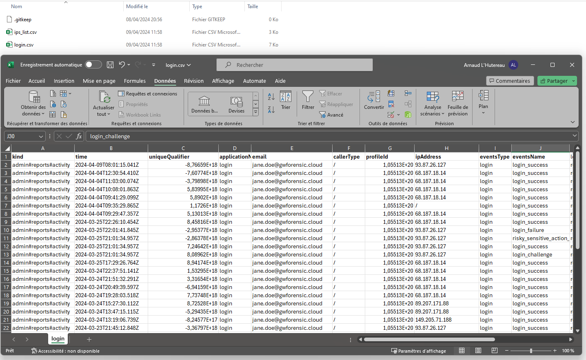

# GWForensic
---
## Collect and analyze Google Workspace events

DFIR project to collect and analyze events in Google Workspace.

# Main features
GW Forensic is a Google Workspace log analysis tool designed to assist analysts in investigating suspicious events/incidents within a Google Workspace instance in 3 phases:


### #1 - Understanding and documenting existing threats

Using documentation based on MITRE techniques adapted to the Cloud and Google Workspace, documentation sheets are intended to understand the various malicious actions that can be performed on the platform and how to mitigate them.

- TTPs documentation sheets
- SIGMA detection rules

### #2 - Collecting logs

The tool aims to automatically extract logs in universal formats to allow the analyst to focus on identifying malicious patterns:
- CSV
- JSON
- OpenSearch

### #3 - Analyzing logs

Based on documentation of suspicious events, the tool automatically tags certain logs as suspicious to facilitate analysis work by categorizing them according to MITRE techniques.

Additionally, the list of observed IP addresses is extracted to allow the analyst to verify malicious indicators.


# How to use

## 0. Prerequisites

- An administrator account with at least "Reporting" access rights on the Google Workspace domain.

## 1. Generate an OAuth Client

The guide to retrieve the OAuth client token is available in the "Documentation" section.

## 2. Configure GW Forensic

You can configure GW Forensic by modifying the `config.yml` file at the root of the project. 
You can customize settings like :
- Services
- Users
- Date
- Export format

More details are available in "Documentation" section.

## 2. Launch GW Forensic

Once configured, you can launch GW Forensic:

#### Python Version

After installing the necessary libraries:
```
pip install -r requirements.txt
```

you can run it:
```
python gwforensic config.yml
```

> On the first launch, a window/link will open to request authentication and grant access rights to the application. It is necessary to authenticate with the account possessing the reporting rights. A new token JSON file will be generated and used by the application. More information in "Documentation" section.

#### Docker Version

Take a look at our Docker documentation ==>  documentation > gwforensic_usage


## 3. Analyze!

Once the tool has finished collecting and exporting the data, the analyst can begin working on the logs to identify malicious behaviors.

### Logs example

#### CSV format



#### OpenSearch format


# Known issues

#### redirect_uri_mismatch (first launch)
Verify that the fields entered in the OAuth client are compliant with the documentation.

#### Opensearch export
Check if an index already exists with the same name. Choose a new (unique) one and enter it in the configuration file, then restart the tool.

#### Timesketch export
Check if a sketch already exists with the ID or if a timeline already has the name provided in the configuration file. Choose a new (unique) one and enter it in the configuration file, then restart the tool.

# Contact

If you want to contact us for any questions regarding this tool, send us an email to cert at own dot security.

# Next

- Improve Timesketch export format
- Add new documentation about TTPs
