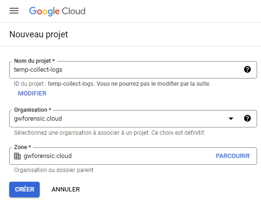
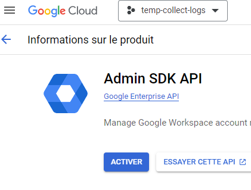
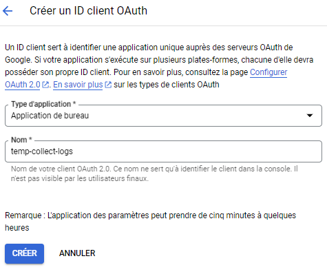

# GW Forensic Usage

## Get client OAuth token

With an administrator account (with "reporting" permission), go to the Google Cloud Console (https://console.cloud.google.com/)

---

> To avoid activating elements within an already existing project, it is recommended to generate the client in a dedicated project that can be completely deleted at the end of the collection process.

| Step  | Description          | Image |
| :--------------- |:---------------:|:-----:|
| #1  |   Create a new GCP Project        |   |
| #2 | Enable `Admin SDK API` in "API & Services > Library" ([Direct link](https://console.cloud.google.com/apis/library/admin.googleapis.com))              |    |
| #3 | In `Consent Screen` ([Direct link](https://console.cloud.google.com/apis/credentials/consent)), configure it : internal APP, app name, help email, dev email and click to continue             |    |
| #4 | In `Credentials` ([Direct link](https://console.cloud.google.com/apis/credentials)), create a new OAuth client ID and select "desktop app", fill name app.              |    |
| #5 | Download JSON file and give it to the analyst|  |
