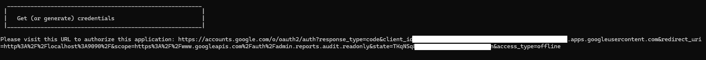
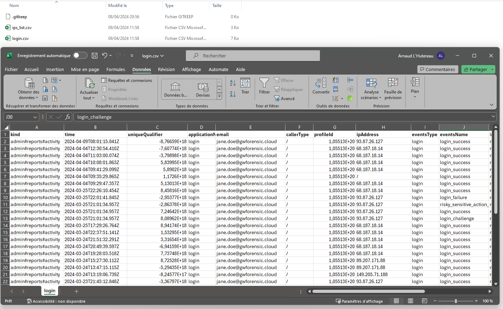

# GW Forensic Usage

### Prerequisites

- Having `credentials.json` at the root of the folder
- Having administrator account
- Python libs installed (`pip install -r requirements`)

## Run

### First launch

> On the first launch, the tool will search for the authentication token. Since it does not exist, it will generate it using the credentials.json file along with the authorization granted by the administrator account.

A message will display in the console and a website will open to ask permission to access to Google account. The administrator account needs to log in and authorize the application to access the reports.


You can launch GW Forensic with the following command :
```
python gwforensic.py config.yml
```





After it, you can close the browser and get back to the console. Script will automatically start after generating current token, `token.json`.

The tool will now use it without asking permission again. 


---

## Results rendering

```
C:\Users\Arnaud\Documents\GWForensic>python gwforensic.py config.yml
   ______        __  _____ ___  ____  _____ _   _ ____ ___ ____
  / ___\ \      / / |  ___/ _ \|  _ \| ____| \ | / ___|_ _/ ___|
 | |  _ \ \ /\ / /  | |_ | | | | |_) |  _| |  \| \___ \| | |
 | |_| | \ V  V /   |  _|| |_| |  _ <| |___| |\  |___) | | |___
  \____|  \_/\_/    |_|   \___/|_| \_\_____|_| \_|____/___\____|

     Collect, parse and analyze all Google Workspace logs!

                https://github.com/OWNsecurity


  __________________________________________________________
 |                                                          |
 |   Configuration                                          |
 |__________________________________________________________|

Logs sources          : login
Users                 : jane.doe@gwforensic.cloud
Date                  : no limitation
Export format         : csv
Export folder         : ./export/

  __________________________________________________________
 |                                                          |
 |   Get (or generate) credentials                          |
 |__________________________________________________________|

Please visit this URL to authorize this application: https://accounts.google.com/o/oauth2/auth?response_type=code&client_id=320XXXXXXXXXXXXXXXXXXXXXXX4v9.apps.googleusercontent.com&redirect_uri=http%3A%2F%2Flocalhost%3A9090%2F&scope=https%3A%2F%2Fwww.googleapis.com%2Fauth%2Fadmin.reports.audit.readonly&state=TKqNSqXXXXXXXXXXXXXXsO5n&access_type=offline


  __________________________________________________________
 |                                                          |
 |   Collect & export logs                                  |
 |__________________________________________________________|

Collecting login logs...
Collecting login logs : OK
Writing login.csv logs in CSV file...
Writing 37 login.csv logs in CSV file : OK


  __________________________________________________________
 |                                                          |
 |   Export IPs list                                        |
 |__________________________________________________________|

Writing ips_list.csv logs in CSV file...
Writing ips_list.csv logs in CSV file : OK


  __________________________________________________________
 |                                                          |
 |   Result                                                 |
 |__________________________________________________________|

All logs have been collected and exported!
```

We can find in `./export/` folder our two files :
- ips_list.csv
- login.csv


