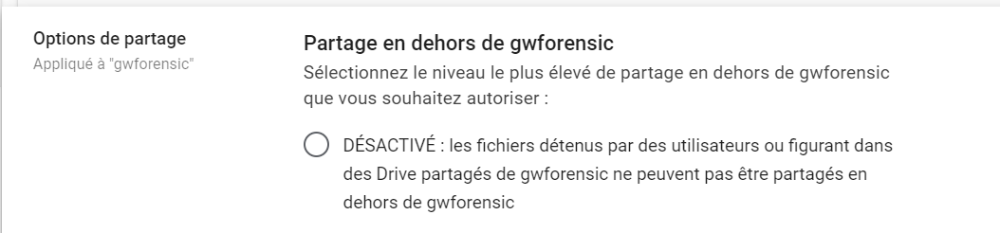

# Data from Cloud Storage

## Description

Google Workspace provides file storage through Google Drive, among other features.

## Example of attack

An attacker has several methods to retrieve data from Google Drive storage:
- Manually, through the graphical interface by downloading, printing, or sharing documents externally.
- Automatically
  - Via the Google Drive desktop client, which allows synchronization of the drive to the workstation.
  - Via API using a token authorized by the account to perform operations with the Drive service (create, modify, delete files).
  - Via API using a third-party script, outside the domain, via a script created by the attacker or by using an internal App Script to perform operations on the files.

## MITRE documentation

- Tactic : Collection
- Technique : Data from Cloud Storage
- Sub-technique : /
- ID : [T1530](https://attack.mitre.org/techniques/T1530/)

## Detection

Several events can generate logs within the domain.

### Google Workspace related events

- download
- print
- create_script_trigger

## Remediation

Depending on the export method used by the attacker, the analyst will perform various operations such as:
- Temporary account deactivation
- Revocation of ongoing sessions
- Revocation of third-party applications connected to the account
- Searching for information on the device used during the compromise (work computer, attacker's computer...)

## Recommendations

There are several features to reduce data leakage within the Drive space.

### Block sharing of Drive documents to the internet

It is possible to disable the ability to share documents to the internet (exposing a link accessible to anyone who has it).

### Block the use of the Google Drive desktop client.

It is possible to disable the use of the Google Drive desktop client for the domain. Thus, it will not be possible to connect access files and synchronize them.

> If the tool was already installed, the files can remain on the workstation but synchronizations will no longer work.

