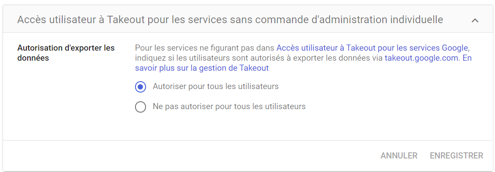

# Email Collection

## Description

There are several methods to collect and archive emails from the account:

- Google Takeout
- Manual inspection
- Gmail API

## Example of Attack

An attacker who has compromised an account may collect emails to exfiltrate it at a later time. They may also set up an automatic email forwarding rule for future emails.

## Mitre documentation

- Tactic : Collection
- Technique : Email Collection
- Sub-technique : XXXXX
- ID : [T1114](https://attack.mitre.org/techniques/T1114/)

## Detection

Several events can generate logs within the domain.

### Google Workspace related events

- email_forwarding_out_of_domain
- create_script_trigger

## Investigation
As part of an incident, the analyst can verify if data collection is ongoing.

Furthermore, a manual review of Google Takeout logs is necessary since they are not directly available via API.

## Recommendations

Google Workspace offers solutions to prevent data leakage from emails.

### Disable Google Takeout
The Takeout solution can be disabled for the domain.

### Disable automatic forwarding feature

It is possible within the Gmail settings of the domain to disable the automatic mail forwarding feature.

