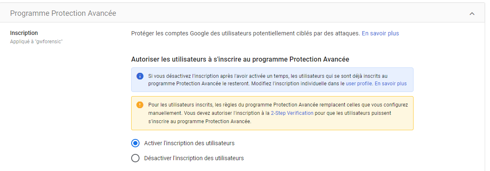

# Brute force

## Description

A brute force attack corresponds to an attempt to access an account without knowing the password and by using a pre-generated list.

## Example of attack

An attacker has obtained a list of passwords used by the user from various leaks on other sites. They will attempt to use these passwords to log into the Google account.

## MITRE documentation

- Tactic : Credential Access
- Technique : Brute Force
- Sub-technique : /
- ID : [T1110](https://attack.mitre.org/techniques/T1110/)

## Détection

Several events can generate logs within the domain.

### Google Workspace related events

- login_failure
- FAILED_PASSWORD_ATTEMPTS_EVENT
- suspicious_login
- account_disabled_password_leak
- CHROME_OS_LOGIN_FAILURE_EVENT

## Investigation

The analyst can investigate the source of the connection to determine if it originates from a legitimate source (IP consistently used over the past 2 months...) or if the accesses appear suspicious.

Then, it's necessary to ensure that no malicious actions have been performed following a successful connection.

## Recommendations

Google Workspace offers several features to limit the risk of brute force attacks.

### Enabling 2FA

It is possible to suggest (or enforce) and configure the accepted 2FA methods on the accounts.

### Enabling the Advanced Protection Program

It is possible to activate the program on accounts to enhance security and access to data: enforcing the use of 2FA, limiting the rights granted to third-party applications (via OAuth tokens)... More information is available on the official program page : https://landing.google.com/advancedprotection/

### Implementation of contextual access rules

It is possible to implement access rules to restrict access to Google services. For example, limiting access to a specific IP address, or to a specific version of Google Chrome.

> Editions compatible with this feature: Frontline Standard; Enterprise Standard and Enterprise Plus; Education Standard and Education Plus; Enterprise Essentials Plus; Cloud Identity Premium.

> The admin portal is normally not subject to contextual access rules.
