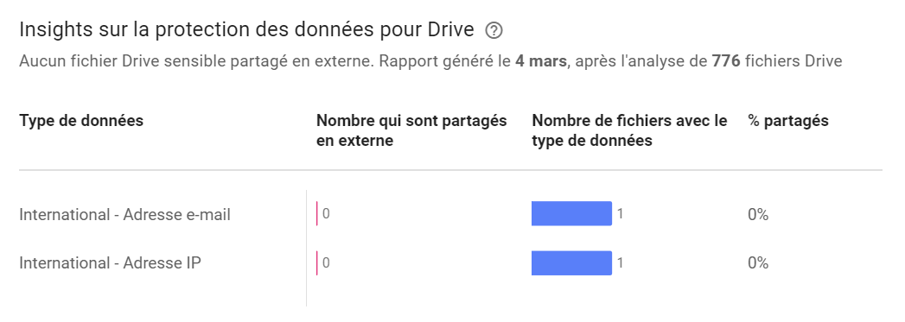

# Unsecured Credentials

## Description

Some users may store passwords or secrets in items stored in Google Workspace:
- Email
- Drive documents
- ...

## Example of attack

An attacker logged into a compromised account can search the user's Google Drive space to find traces of files containing secrets, using common patterns:
- secret
- password
- config
- key

## MITRE documentation

- Tactic : Credential Access
- Technique : Unsecured Credentials
- Sub-technique : /
- ID : [T1552](https://attack.mitre.org/techniques/T1552/)

## Detection

It is possible to identify access to Drive documents during the time of the incident, allowing detection of unauthorized access to identification data.

### Google Workspace related events

- view

## Investigation

The analyst need to identify accesses for which credentials have been leaked in order to reset them.

## Recommendations

Google Workspace offers several features to detect the presence of secrets in Google documents before an incident occurs.

### Creation of security rules on outgoing emails

It is possible to configure content rules on outgoing emails to identify the sending of credentials considered as data leakage or exposure of credentials:
- Automatic forwarding of the email to the security team for verification
- Blocking the email
- Placement in a quarantine area for manual review

### Creation of pattern detection rules on Drive documents

It is possible to configure compliance rules on Google Drive to apply a policy on documents containing certain types of patterns:

IP address
Secrets
Personal data
...

Several secrets can be identified by the algorithm : https://support.google.com/a/answer/7047475#zippy=%2Cidentifiants-et-secrets

> Compatible editions for this feature: Frontline Standard; Enterprise Standard and Enterprise Plus; Education Fundamentals, Education Standard, Teaching and Learning Upgrade, and Education Plus; Enterprise Essentials Plus.

