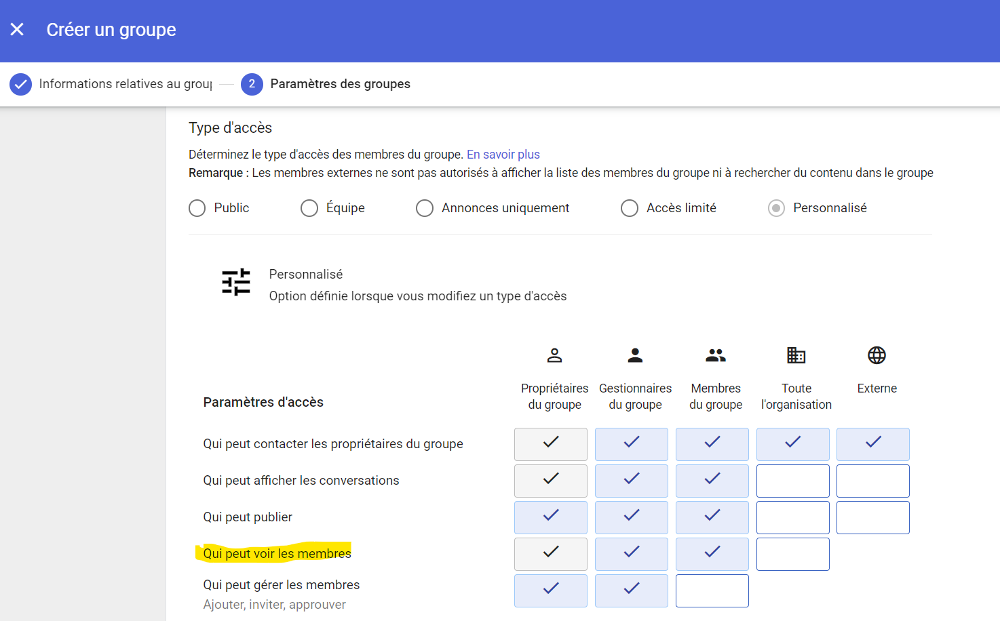

# Account Discovery

## Description

It is possible to list domain accounts on Google Workspace through various accessible groups when they are misconfigured.

## Example of Attack

Using a compromised account, an attacker can access the list of distribution groups (https://groups.google.com/all-groups) to try to list as many accounts as possible.
Some groups are dedicated to specific operations (the right to use a particular application), and the group's visibility configuration may not have been properly set.
The attacker can therefore access the list of members that compose it.

## MITRE documentation

- Tactic : Discovery
- Technique : Account Discovery
- Sub-technique : Email Account
- ID : [T1087.003](https://attack.mitre.org/techniques/T1087/003/)

## Detection

No detection method is available.

### Google Workspace related events

/

## Investigation

It is possible to perform a manual / automatic review of existing groups to verify associated visibility rules.

Administrators should be made aware of privacy considerations during the process of group creation and rights assignment.

Even more attention should be paid to groups that gather many members of the organization (generic email address linked to a country, a department, etc.).

