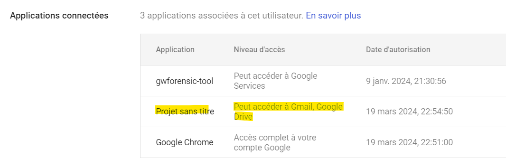
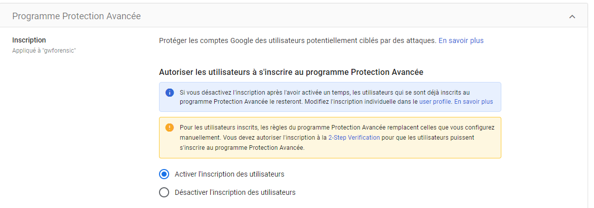

# Scheduled Task/Job

## Description

Google App Script is a development platform that allows creating plugins and automations with Google Workspace services while being hosted online. Google App Script can interact notably with:

Gmail
Drive
Calendar
Admin
Meet
...

During the first execution, the application requests access from the user, who must accept to grant the indicated accesses for the proper functioning of the application. Once accepted, no further requests are made.

## Example of Attack

An attacker can create code via Google App Script to automate certain malicious actions. It is possible to create triggers to execute the code in the future.

They can, for example:
- search Drive documents
- browse through various emails
- send emails
- ...

A generic name/system can be given to deceive security teams.

Since the application is hosted directly on Google, no suspicious traffic occurs with a third-party application.

## MITRE documentation

- Tactic : Execution
- Technique : Scheduled Task/Job
- Sub-technique : /
- ID : [T1053](https://attack.mitre.org/techniques/T1053/)

## Detection

Several detection methods can be used:
- Creating a Google App Script file on Google Drive generating an event
- Execution of the application and the associated token generating an event

The various actions performed by the code, on behalf of the user, can generate additional logs.

### Related Google Workspace Events

- create_script_trigger

## Remediation

The analyst will be able to revoke the token of the permissions granted by the impersonated user to the malicious application.

It is important to then investigate other potentially impacted users by this application in case of dissemination.

The file must then be deleted, and the account that originated the creation of the file should be traced to investigate a potential account compromise.

## Recommendations

Google Workspace offers several features to prevent the execution of untrusted code :

### Enabling the Advanced Protection Program

It is possible to activate the program on accounts to enhance security and access to data: enforcing the use of 2FA, limiting the rights granted to third-party applications (via OAuth tokens)... More information is available on the official program page : https://landing.google.com/advancedprotection/

### Enabling a list of authorized applications.

It is possible to define a list of applications authorized to be executed on domain accounts. If an application is not on this list, a customizable error message can be displayed.
