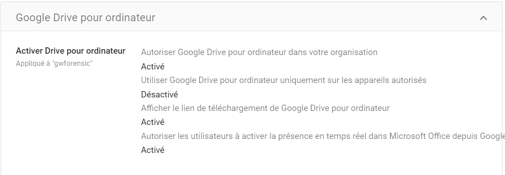
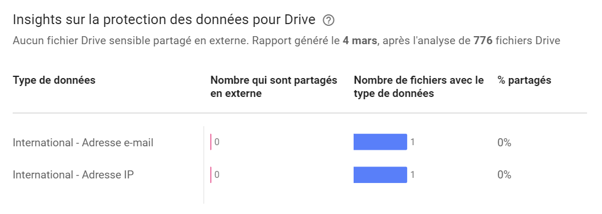

# Exfiltration Over Web Service

## Description

There are several methods to export data on Google Workspace.

## Example of Attack

An attacker can exfiltrate data in several ways:
- By retrieving data via Google Drive, using the graphical interface, downloading, printing, or sharing files externally.
- By copying data from Google documents belonging to another entity (drive of an attacker's account).
- By sending documents via Chat messages to an external account outside the company.
- By sending emails with attachments or within the body of the email.

> Note that Google services are used to exfiltrate the data, so it is challenging to restrict access to these services.

## MITRE documentation

- Tactic : Exfiltration
- Technique : Exfiltration Over Web Service
- Sub-technique : /
- ID : [T1567](https://attack.mitre.org/techniques/T1567/)

## Detection

Several events can signal an attempted data exfiltration:

### Related Google Workspace Events

- EXPORT_JAMBOARD_FLEET
- export_calendar
- print_preview_calendar
- DATA_EXPORT
- DOWNLOAD_REPORT
- DLP_EVENT
- CONTENT_TRANSFER
- SENSITIVE_DATA_TRANSFER
- ACCESS
- download
- print
- GROUP_MEMBERS_DOWNLOAD
- DOWNLOAD_USERLIST_CSV

## Remediation

The analyst can take emergency measures by suspending the account responsible for the leak and revoking its various API accesses and third-party applications.

Subsequently, an investigation should be conducted to detect the affected files and the various methods used by the attacker.

## Recommendations

There are several techniques, more or less restrictive, to limit data leakage on Google Workspace.

### Blocking Drive Document Sharing to the Internet

It is possible to disable the ability to share documents to the Internet (exposing a link accessible to anyone possessing it).

### Blocking the use of the Google Drive desktop client

It is possible to disable the use of the Google Drive desktop client for the domain. Therefore, it will not be possible to log in to access files and synchronize them.

> If the tool was already installed, the files can remain on the workstation but that future synchronizations no longer work.

### Disable Google Takeout

The Takeout service can be disabled on the domain.

### Disable Automatic Forwarding Feature

In the Gmail domain settings, the automatic email forwarding feature can be disabled.

### Enabling a list of authorized applications.

A list of authorized applications can be defined to be executed on domain accounts. If an application is not on this list, a customizable error message can be displayed.

### Creating Outgoing Mail Security Rules

It is possible to configure content rules on outgoing emails to identify the sending of credentials considered as data leakage or exposure of credentials:
- Automatically forward the email to the security team for verification
- Block the email
- Place it in a quarantine area for manual review

### Creating Pattern Detection Rules on Drive Documents

Compliance rules can be configured on Google Drive to enforce a policy on documents containing certain types of patterns:
- IP addresses
- Secrets
- Personal data
- ...

Several secrets can be identified by the algorithm : https://support.google.com/a/answer/7047475#zippy=%2Cidentifiants-et-secrets

> Compatible editions for this feature: Frontline Standard; Enterprise Standard and Enterprise Plus; Education Fundamentals, Education Standard, Teaching and Learning Upgrade, and Education Plus; Enterprise Essentials Plus.

### Disable Chat Exchanges with External Individuals

The ability to create conversations with accounts that do not belong to the domain can be disabled.

