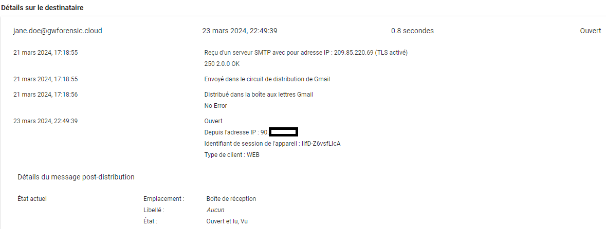
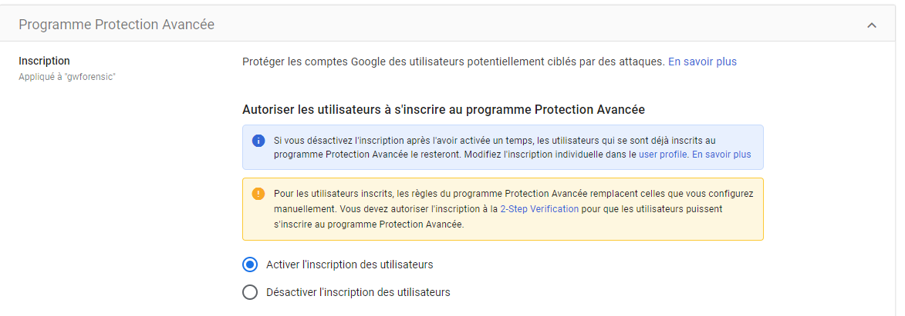
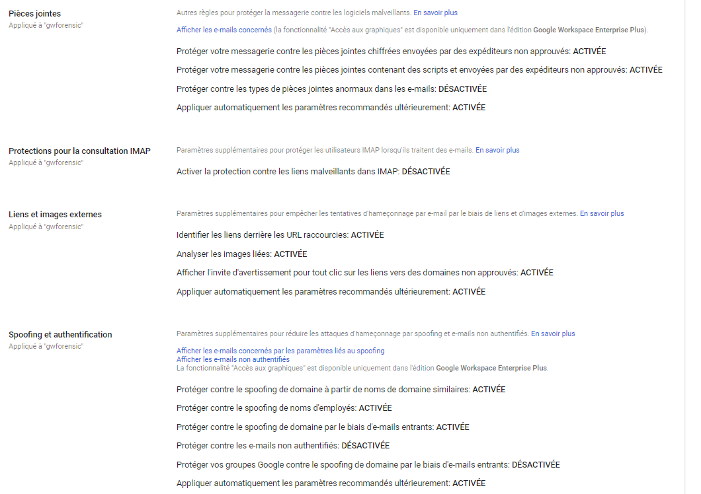
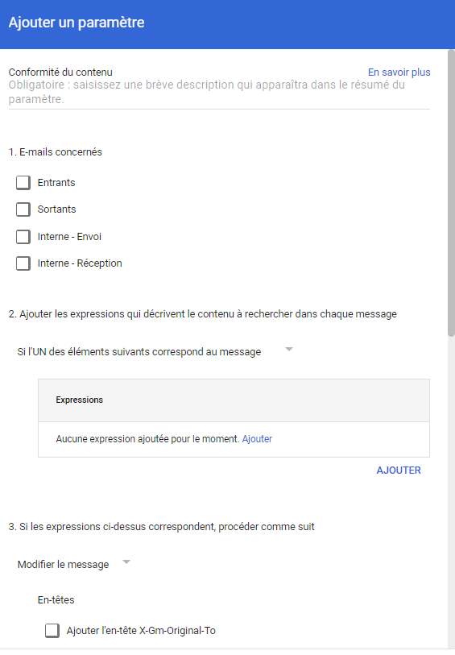
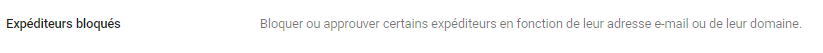

# Phishing

## Description

An attacker can send phishing emails to the victim in order to persuade them to enter their credentials (Google or others) on a malicious website.

## Example of Attack

The attacker will send a phishing email to the victim's professional address or to a distribution list containing the victim.

## MITRE documentation

- Tactic : Initial Access
- Technique : Phishing
- Sub-technique : DNS
- ID : [T1566](https://attack.mitre.org/techniques/T1566/)

## Detection

Some phishing emails generate automatic alerts in the Alert Center following a Google requalification.

You can monitor these alerts to be notified as early as possible.

### Google Workspace-related Events

/

## Invedtigation

Depending on the subscribed Google Workspace subscription, an analyst, through the admin panel, can perform operations on malicious emails and check Gmail logs to learn more about the actions taken by the victim (open, click...).

Proactively, the analyst will be able to review the actions taken by the victim:
- Opening the email
- Location of the email
- Type of client used

> All versions

## Remediation

Proactively, the analyst can:
- Remove the email from the victim's inbox
- Move the email to the victim's spam folder
- Investigate the content of the email and the attachment (possible access to the hash or download of the attachment)

> Available in Enterprise Plus, Education Standard, Education Plus, and Enterprise Essentials Plus versions.

## Recommendations

Google Workspace offers various features to enhance security against phishing.

### Enabling the Advanced Protection Program

It is possible to activate the program on accounts to enhance security and access to data: enforcing the use of 2FA, limiting the rights granted to third-party applications (via OAuth tokens)... More information is available on the official program page : https://landing.google.com/advancedprotection/

### 2FA activation

It is possible to offer (or enforce) and configure accepted 2FA methods on accounts.

### Apply Enhanced Security Settings on Incoming Emails

It is possible to enable or disable several options used for account protection against incoming emails:

- Protect your mailbox against encrypted attachments sent by unapproved senders
- Protect your mailbox against attachments containing scripts and sent by unapproved senders
- Identify links behind shortened URLs
- Analyze linked images
- Display a warning prompt for any clicks on links to unapproved domains
- Enable protection against malicious links in IMAP
- Protect against domain spoofing from similar domain names
- Protect against employee name spoofing
- Protect against domain spoofing through incoming emails
- Protect your Google Groups against domain spoofing through incoming emails

### Creating Security Rules on Incoming Emails

It is possible to configure content rules on incoming emails to identify malicious patterns. Actions can be taken upon detection:
- Automatically forward the email to the security team (email forwarding)
- Block the email
- Place it in a quarantine area for manual review

### Blocking specific Senders

As part of spam/phishing campaigns, it is possible to add specific domains or email addresses that will be automatically blocked.

### Implementation of Context-Aware Access Rules

It is possible to implement access rules to restrict access to Google services. For example, limiting access to a specific IP address or a specific version of Google Chrome.

> Compatible editions for this feature: Frontline Standard; Enterprise Standard and Enterprise Plus; Education Standard and Education Plus; Enterprise Essentials Plus; Cloud Identity Premium.

> The administration portal is typically not sensitive to context-aware access rules.
