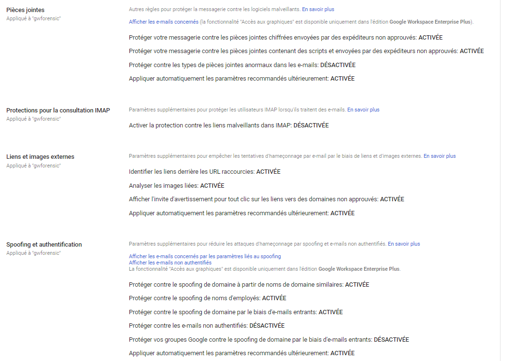
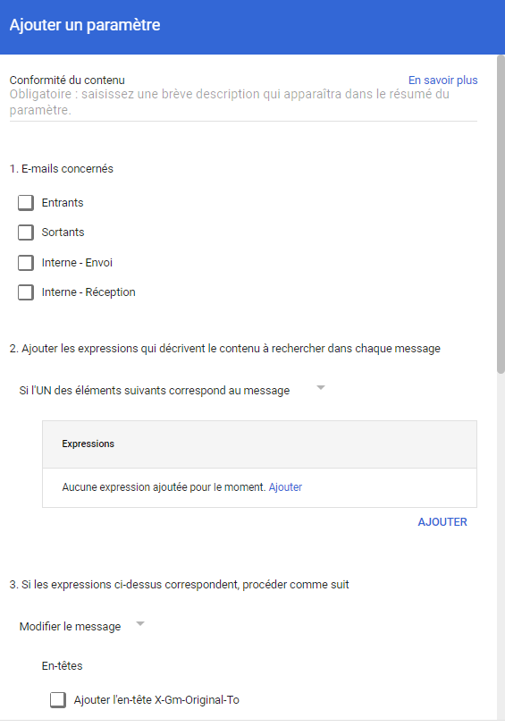

# Internal Spearphishing

## Description

Targeted phishing emails can be received by domain accounts with the goal of retrieving their login credentials.

## Example of Attack

Once the attacker is logged into a first compromised account, they can send targeted phishing emails internally to specific accounts to retrieve their login credentials and thus better propagate within the environment.

## MITRE documentation

- Tactic : Lateral Movement
- Technique : Internal Spearphishing
- Sub-technique : /
- ID : [T1534](https://attack.mitre.org/techniques/T1534/)

## Detection

Some phishing emails generate automatic alerts in the Alert Center following a Google requalification.

It is possible to monitor these alerts to be notified as early as possible.

### Related Google Workspace Events

/

## Investigation

Proactively, the analyst can review the actions taken by the victim:
- Opening the email
- Location of the email
- Type of client used

Given that the sender account is internal, an investigation must be conducted on this account to confirm the compromise and halt the malicious activity.

## Remediation

Depending on the subscribed Google Workspace subscription, an analyst, through the admin panel, can perform operations on malicious emails and consult Gmail logs to learn more about the actions taken by the victim (open, click...).

Proactively, the analyst can:
- Remove the email from the victim's inbox
- Move the email to the spam folder of the victim's mailbox
- Investigate the content of the email and the attachment (possible access to the hash or download of the attachment)

> Available in Enterprise Plus, Education Standard, Education Plus, and Enterprise Essentials Plus versions.

Therefore, the account may be temporarily suspended pending analysis, login sessions revoked, and the lists of applications with access to the accounts reviewed/revoked.

> Please note, a suspended account may no longer receive new emails.

## Recommendations

Google Workspace offers various features to enhance security against phishing.

### Enabling the Advanced Protection Program

It is possible to activate the program on accounts to enhance security and access to data: enforcing the use of 2FA, limiting the rights granted to third-party applications (via OAuth tokens)... More information is available on the official program page : https://landing.google.com/advancedprotection/

### 2FA activation

It is possible to offer (or enforce) and configure accepted 2FA methods on accounts.

### Apply Enhanced Security Settings on Incoming Emails

It is possible to enable or disable several options used for account protection against incoming emails:

- Protect your mailbox against encrypted attachments sent by unapproved senders
- Protect your mailbox against attachments containing scripts and sent by unapproved senders
- Identify links behind shortened URLs
- Analyze linked images
- Display a warning prompt for any clicks on links to unapproved domains
- Enable protection against malicious links in IMAP
- Protect against domain spoofing from similar domain names
- Protect against employee name spoofing
- Protect against domain spoofing through incoming emails
- Protect your Google Groups against domain spoofing through incoming emails

### Creating Security Rules on Incoming Emails

It is possible to configure content rules on incoming emails to identify malicious patterns. Actions can be taken upon detection:
- Automatically forward the email to the security team (email forwarding)
- Block the email
- Place it in a quarantine area for manual review

