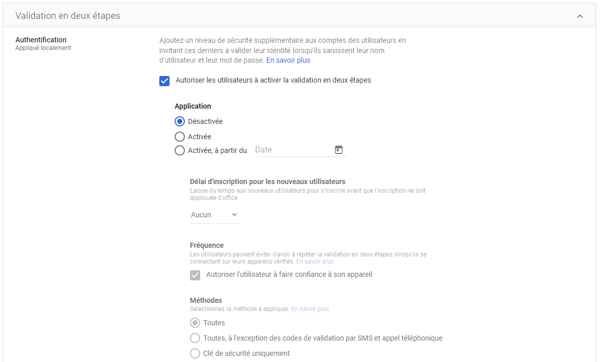

# Account Manipulation

## Description

A user account can modify its settings to add information, modify recovery information, etc.

## Example of Attack

Once the attacker has accessed the victim's account, they can navigate to the account settings and modify information such as:
- Changing the password
- Disabling 2FA
- Revoking access to existing third-party applications (and accessing the services)
- Modifying the recovery phone number
- Modifying the recovery email address
- Adding or removing security keys
- Accessing hardware linked to the account
- Accessing the Google password manager

If GCP is being used and there is access to a GCP project containing virtual machines (VMs), the attacker can add their own SSH key to the project's metadata, allowing them to be authorized to connect (https://cloud.google.com/compute/docs/connect/add-ssh-keys?hl=fr).

## MITRE documentation

- Tactic : Persistence
- Technique : Account Manipulation
- Sub-technique : / (SSH Authorized Keys - 004)
- ID : [T1098](https://attack.mitre.org/techniques/T1098/)

## Detection

It is possible to detect suspicious connection events generated by Google Workspace in the logs (see below).

### Related Google Workspace Events

- 2sv_enroll
- password_edit
- recovery_email_edit
- recovery_phone_edit
- recovery_secret_qa_edit
- DEVICE_REGISTER_UNREGISTER_EVENT
- PASSWORD_CHANGED
- PASSWORD_REUSE
- TOGGLE_ALLOW_ADMIN_PASSWORD_RESET
- 2sv_disable
- IMPORT_SSH_PUBLIC_KEY
- UPDATE_SSH_PUBLIC_KEY

## Remediation

The analyst can delete the login cookies to disconnect the user and thus the attacker from all devices and browsers.

The victim's account can also be temporarily suspended and the password reset while awaiting contact with them for reactivation.

> Note, an administrator cannot suspend an account with an equivalent or higher level of rights. If an administrator account needs to be suspended due to compromise, only the super-administrator account will be able to perform the operation.

A comprehensive review of the modifications made to the account is then necessary to ensure that no traces of persistence remain, allowing the attacker to continue performing malicious actions or return more easily later.

On the GCP platform side, it is important to check if any changes have been made to the connection metadata for the various VMs. The attacker may have potentially added or modified an SSH key to allow the connection.

## Recommendations

Google Workspace offers options to combat persistence:

### Disable the option to recover a user account with a forgotten password

Users other than super administrators will not be able to recover their own account if they forget their password. They will have to go through the company's IT department.

This prevents account recovery via a personal email address or phone number hacked or modified by the attacker.

### Enforce the use of 2FA

It is possible to enforce the use of 2FA on Google Workspace domain accounts.

