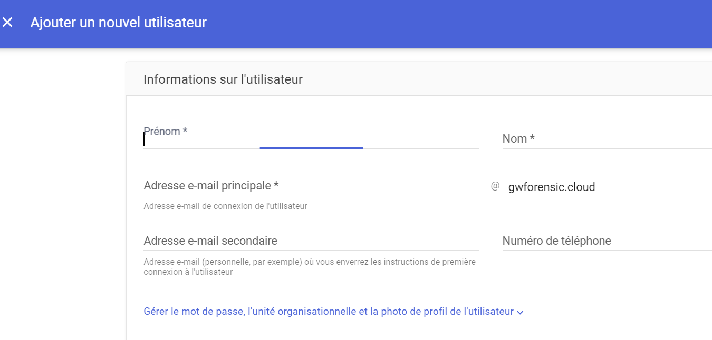

# Create Account

## Description

It is possible to create a new account on the Google Workspace instance.

## Example of Attack

An attacker, if they have the necessary permissions, can create a new account on the domain to establish a method of persistence.

An attacker could potentially create an identity in a GCP project if they have the appropriate permissions, allowing them to obtain an identifier with an API token to perform automated actions.

## MITRE documentation

- Tactic : Persistence
- Technique : Create Account
- Sub-technique : Cloud Account
- ID : [T1136.003](https://attack.mitre.org/techniques/T1136/003/)

## Detection

The creation of a new user generates an event in the Google Workspace logs.

### Related Google Workspace Events

- CREATE_USER

## Remediation

An administrator can temporarily suspend the malicious account created for analysis purposes and then delete it.

It is important to check if any credentials associated with the account have been created on the GCP platform in projects to which the attacker has access rights.

## Recommendations

/
